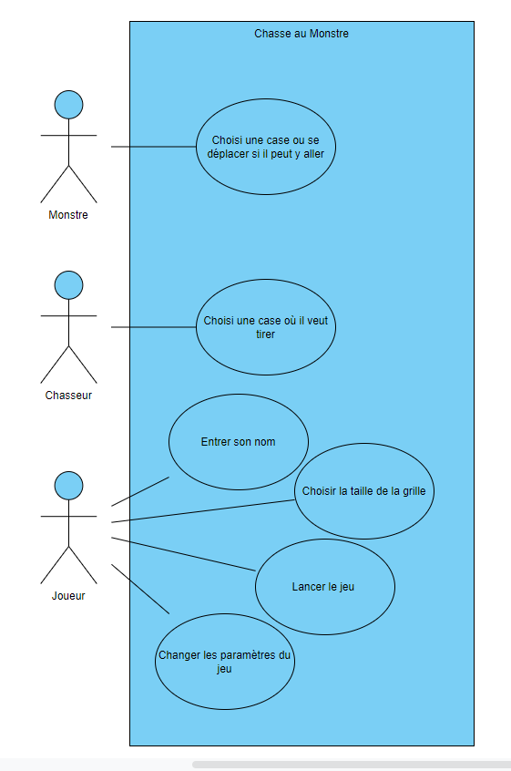
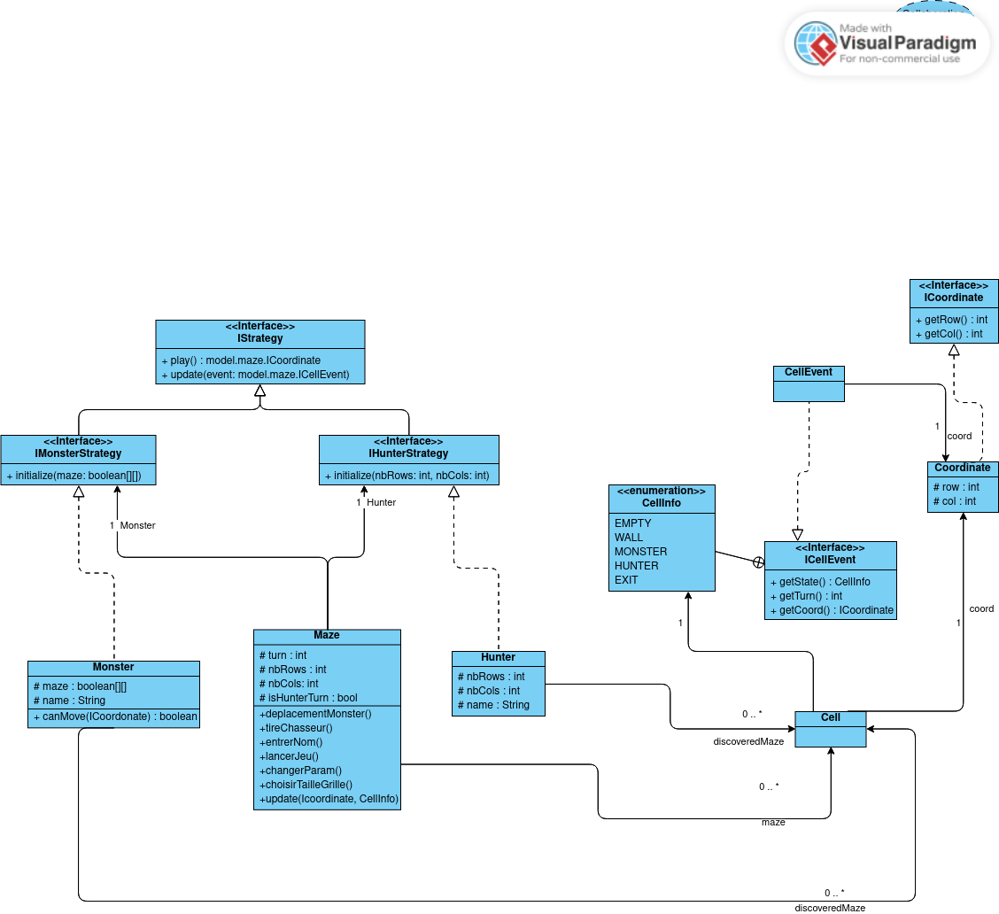

# Analyse SAE3.02 G1
   
## Diagramme de cas d'utilisation  

{width=60%}

\newpage

## Diagramme de classe

{width=100%}

\newpage

## Description de l'implémentation pour les fonctionnalités principales

### Tour du monstre

```pseudo
Maze : deplacementMonstre()
    coord = monster.play()
    Si coord correspond à la sortie (Cellinfo.EXIT)
        On affiche la victoire du monstre
    Sinon
        update(coord, Cellinfo.MONSTER)
        cellEvent = new cellEvent(Cellinfo.MONSTER, coord, tour) 
        monster.update(cellEvent)
        on appelle le tour du chasseur tirerChasseur()

Monster : play() :
    coord = input du joueur donnant les coordonnées de la case où il veut se déplacer.
    Si canMove(Coordinate)
        retourner coord
    Sinon 
        On lui indique qu'il ne peut s'y déplacer et demande de nouvelles coordonnées.

Monster : canMove(coord Coordinate) :
    Si maze.getCell(coord).getState() == Cellinfo.EMPTY ou Cellinfo.Monstre 
    et que coord se trouve à une case de distance du monstre.
        Alors on retourne vrai
    Sinon
        on retourne faux

Maze : update(coord Coordinate, info CellInfo) :
    setCell(coord, info, tour)

Monster : update(event CellEvent) :
    Si cellEvent.getState() est égal à HUNTER
        on stocke new Cell(event.getState(), event.getCoord()) 
        (le tir du chasseur n'est pas dans le discoveredMaze mais stocké dans un attribut 
        qui sera récupéré pour l'affichage uniquement cela évite de supprimer des murs)
    Sinon
        setCell(event.getCoord(),event.getState(),event.getTurn())
```
\newpage
### Tour du chasseur

```pseudo
Maze : tirerChasseur() :
    coord = hunter.play()
    Si coord correspond à une case Cellinfo.MONSTER modifiée au tout actuel 
    (le monstre joue puis le chasseur tire, 
    le monstre est donc sur une case MONSTER changée ce tour)
        On affiche la victoire pour le chasseur
    Sinon
        monster.update( new cellEvent(cellInfo.HUNTER,coordinate,tour))
        info = on récupère l'information de la case de coordonées 'coord'
        event = new cellEvent(info,coord,tour)
        hunter.update(event)
        tour+1 (on passe au tour suivant)
        on appelle deplacementMonstre()

Hunter : play() :
    On attend l'input du chasseur
    On retourne son input 

Hunter : update(event CellEvent) :
    setCell(event.getCoord(),event.getState(),event.getTurn())
```